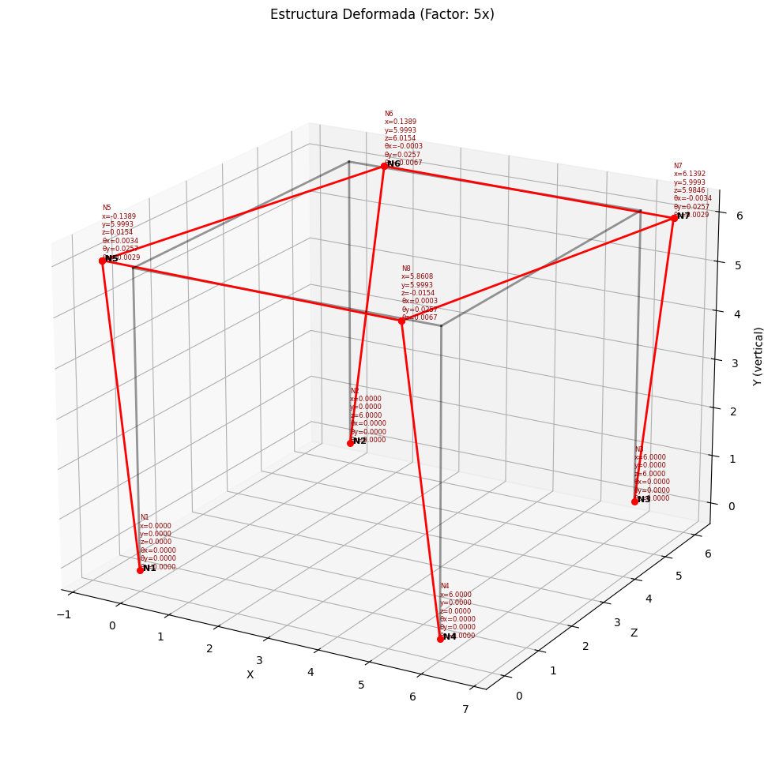
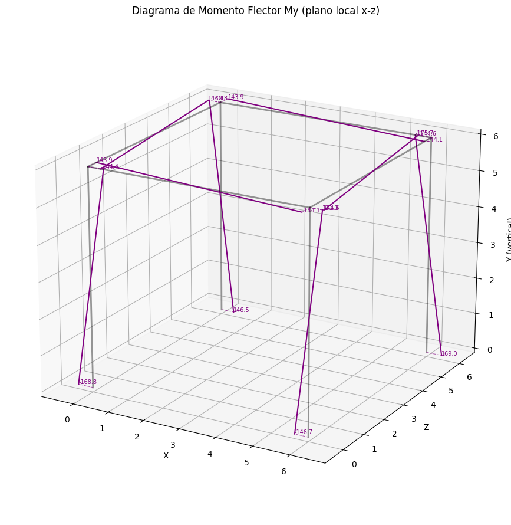

# 2D & 3D Structural Analysis Engine (OOP) 🏗️💻

### Computational motor for matrix analysis of trusses and frames built from scratch in Python.

This repository demonstrates the implementation of the **Direct Stiffness Method** and structural mechanics using a strict Object-Oriented Programming (OOP) architecture. It is designed to solve complex 2D and 3D structural systems, calculating displacements, internal forces, and generating visual outputs without relying on commercial software.

---

### ⚙️ Core Architecture & Capabilities

The engine is built upon custom private Python classes (`Node`, `Element`, `Material`, `Section`, `Structure`), ensuring modularity and efficiency. 

**Key Features:**
* **2D/3D Truss Analysis:** Computation of axial forces and nodal displacements.
* **2D/3D Frame Analysis:** Computation of shear forces, bending moments, torsion, and 6-DOF displacements per node.
* **Automated Assembly:** Algorithmic assembly of the global stiffness matrix $[K]$ and force vectors $\{F\}$.
* **Post-Processing:** Automated generation of formal calculation reports (PDF) and graphical rendering of structural behavior using `matplotlib`.

---

### 📊 Visual Outputs & Demonstrations

The engine automatically renders the structural response. Below are examples generated directly from the Python execution scripts:

#### 1. 3D Frame Deformation & Internal Forces
*A complete 3D spatial frame subjected to gravity and lateral loads.*

*(Left: Original structure | Right: 3D Deformed shape)*

*(Bending moment diagrams for spatial elements)*

#### 2. 2D Frame & Truss Behavior
*Examples of shear and moment diagrams for planar structures.*

*(Shear forces in a 2D continuous frame)*

*(Axial forces distribution in a planar truss)*

---

### 📂 Repository Structure (Showcase)

This repository serves as a technical showcase. The execution scripts (`.py`) and theoretical background (`.pdf`) are public, demonstrating the engine's capabilities and theoretical foundation.

* `Ejercicio_portico_espacial.py`: Execution script for 3D frames.
* `Ejercicio_armadura3D.py`: Execution script for spatial trusses.
* `reporte_portico_3D.pdf`: Automated formal calculation report generated by the engine.
* `Teoría.pdf` & `analisis_3D.pdf`: Mathematical formulation and theoretical background of the algorithms.

> **Note on Intellectual Property:** The core OOP source files containing the matrix assembly logic and solver iterations are kept private as they are part of my premium educational courses.

---
*Developed by Nicolás Játiva - Civil & Structural Engineer*
